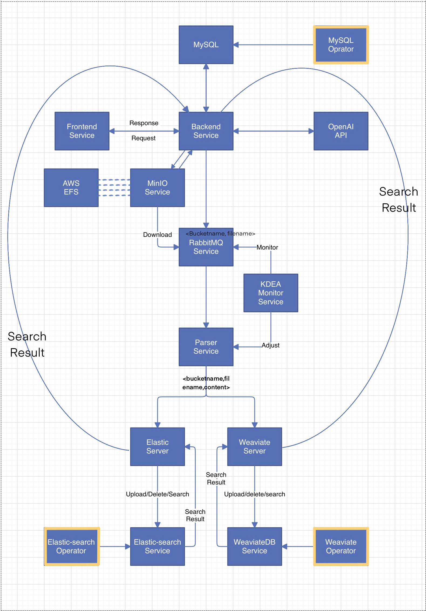
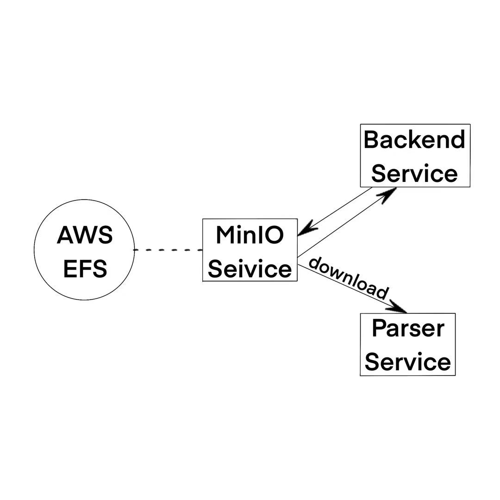
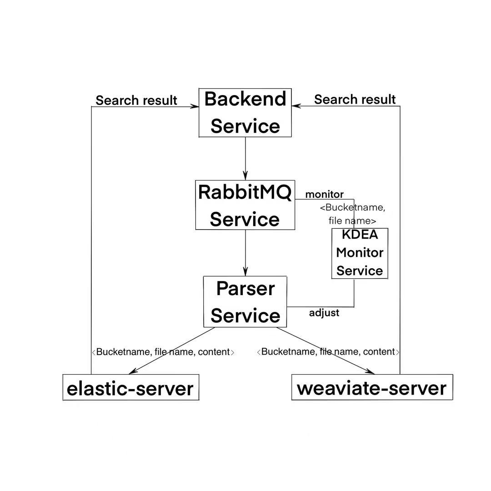
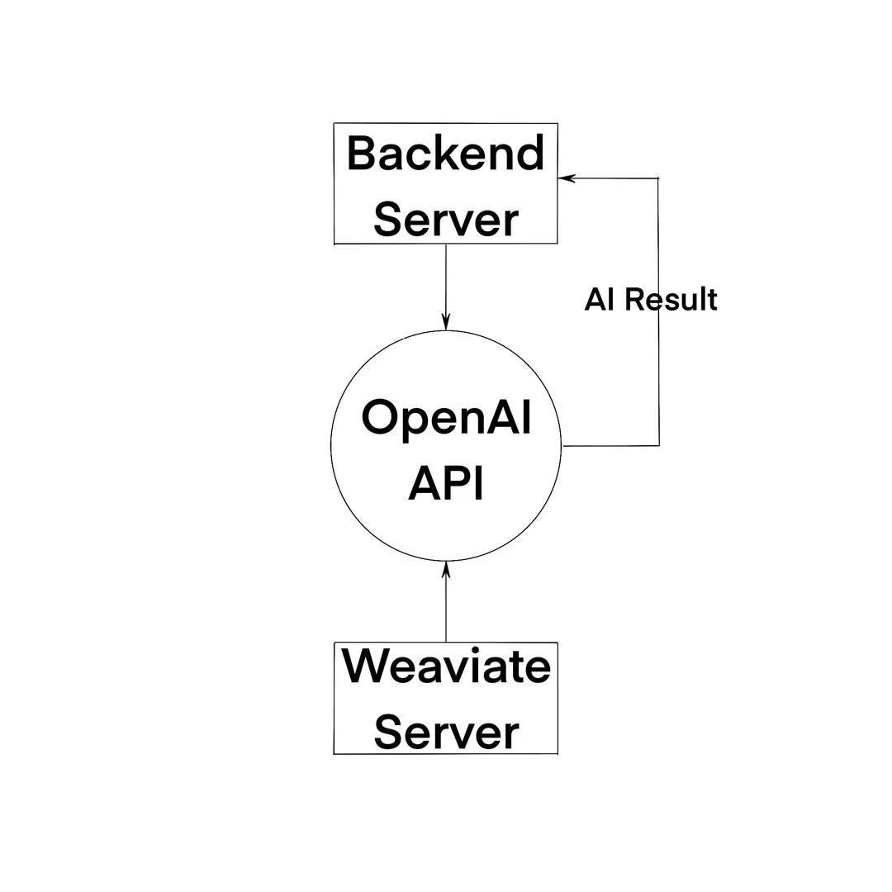

# KloudMinds

Team Member:

- Student 1: Zhengyang Luo, [t0933775].
- Student 2: Ripeng Li, [t0933462]
- Student 3: Yihan Jin, [t0933695]
- Student 4: Yiliu Dong, [t0933287]

## 1. Project Overview

### 1.1 Project Description
```
  _  ___                 _ __  __ _           _     
 | |/ / |               | |  \/  (_)         | |    
 | ' /| | ___  _   _  __| | \  / |_ _ __   __| |___ 
 |  < | |/ _ \| | | |/ _` | |\/| | | '_ \ / _` / __|
 | . \| | (_) | |_| | (_| | |  | | | | | | (_| \__ \
 |_|\_\_|\___/ \__,_|\__,_|_|  |_|_|_| |_|\__,_|___/

```                                               

AI-driven cloud-native file management and R-A-G service

- Large storage space

- Fast retrieval (exact/fuzzy)

- AI reading analysis

### 1.2 System Architecture
#### 1.2.1 General structure


#### 1.2.2 Storage structure


#### 1.2.3 RAG structure


#### 1.2.4 Chat structure


### 1.3 Key Components
- **backend**: Backend, control the whole system, respond to frontend requests and send message to rabbitmq, based on springboot and Java.

- **frontend**: User interface, base on Vue.

- **jiexi-server**: Parse the file(docx, doc, pdf) to pure txt for further process and interact with MinIO, based on Java.

- **retrieve-server**: Vectorize and parallelly upload file chunks, based on Python and flask.

- **chat-server**: Provide chat service, based on Python and flask.

## 2. Environment Setup

### 2.1 Prerequisites
- **Git**
- **Kubernetes**
- **AWS CLI**
- **helm**
- **Java**
- **Maven**
- **Python3 and libs**
- **Javascript**
- **Vue**

### 2.2 Installation
If you are using a Linux distribution or MacOS, all these requirements can be installed using your package manager(zypper, homebrew, apt-get, pacman), just run as follow:

```shell
${your_package_manager} install kubenetes
```

## 3. Application Deployment
**Note that this section has been split into separate instruction files so there is a `readme.md` in each subfolder of the project that gives very detailed deployment and debugging instructions.**

Contents of each subfolder are as follow:

1. `readme.md`: Deployment documentation providing detailed deployment and debugging guidance.

2. `yamls/*.yaml`: Kubernetes configuration files

3. `test/*.test`: Test code

4. `src`: Source code of microservice

Please follow the order 1 -> 2 -> 3 for configuration and deployment:

1. AWS-configure, EFS

2. Minio, elastic-search, monitoring-logging, ndbmysql, rabbitmq，weaviate, retrieve-server, ai-chat-server, jiexi-server

3. backend, frontend

After deployment, you can log in and use the service by accessing the port exposed by the frontend.
