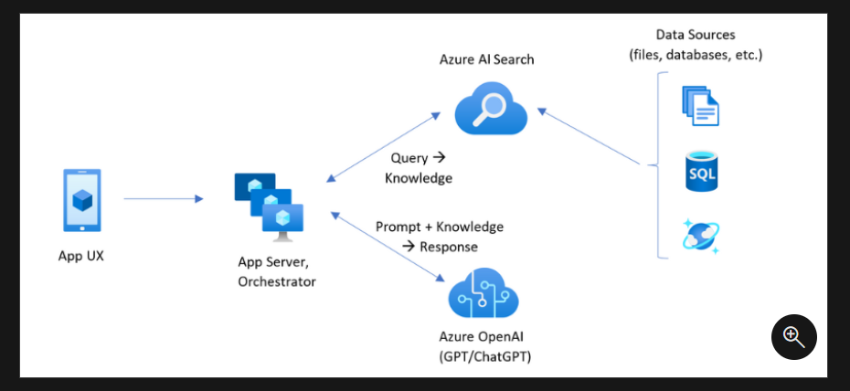

There are several microservices in the backend.
And /ai_chat_service/ is one of them.
This part is the generation in Retrival Augmented Generation (RAG) model.


The directory structure of ai_chat_service is as follows:

```plaintext
ai_chat_service/
├── Dockerfile
├── deployment.yaml
├── service.yaml
└── src/
    ├── app.py
    └── requirements.txt
```


