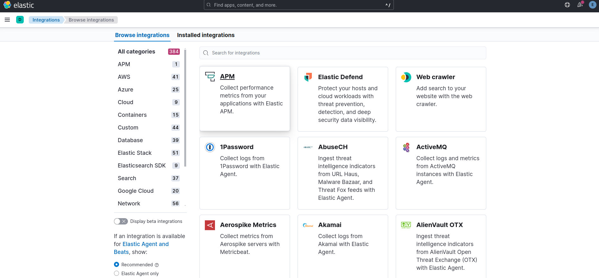

# 1 部署
# 前置条件
确保 EFS/readme.md 中的 3 个操作（配置 cli + 创建并挂在 EFS + 部署 storage-class）已经完成

# operator 部署
```shell
kubectl create -f https://download.elastic.co/downloads/eck/2.13.0/crds.yaml

kubectl apply -f https://download.elastic.co/downloads/eck/2.13.0/operator.yaml

cat <<EOF | kubectl apply -f -
apiVersion: elasticsearch.k8s.elastic.co/v1
kind: Elasticsearch
metadata:
  name: quickstart
spec:
  version: 8.14.3
  nodeSets:
  - name: default
    count: 1
    config:
      node.store.allow_mmap: false
EOF
```

此时服务应该正常启动

# kibana 部署
```shell
cat <<EOF | kubectl apply -f -
apiVersion: kibana.k8s.elastic.co/v1
kind: Kibana
metadata:
  name: quickstart
spec:
  version: 8.14.3
  count: 1
  elasticsearchRef:
    name: quickstart
EOF
```

# 2 运行时调试

## 2.1 获取密码
（默认用户名为 elastic）

```shell
kubectl get secret quickstart-es-elastic-user -o go-template='{{.data.elastic | base64decode}}'
```

## 2.2 使用 Kibana
```shell
kubectl port-forward service/quickstart-kb-http 5601

## 浏览器访问 https://localhost:5601
```

用户名：elastic

密码：2.1 中获得的密码

