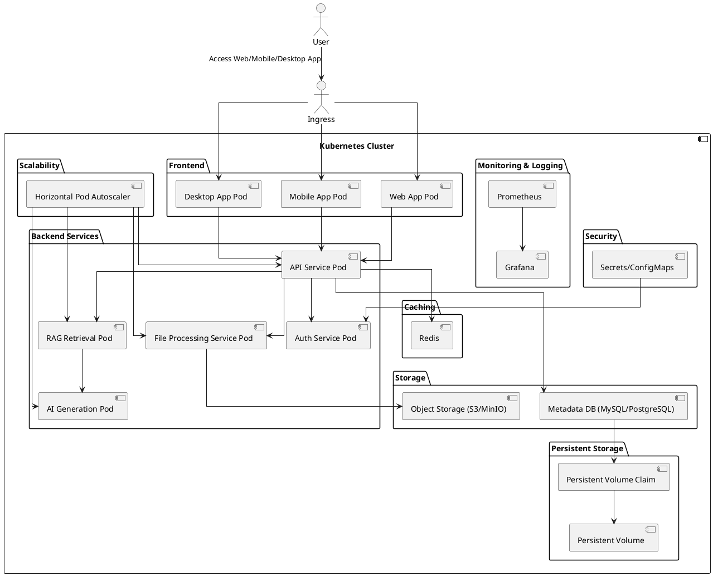

# KloudMinds: Cloud-Native Storage Solution for Big Data and AI-Driven Applications

+++++++++++++++++++++++++++++++++++++++++++++++++++

## Architecture



## Directory Structure

```plaintext
KloudMinds/
├── frontend/
│   ├── web_app/
│   │   ├── Dockerfile
│   │   ├── deployment.yaml
│   │   ├── service.yaml
│   │   ├── src/
│   │   │   ├── index.html
│   │   │   ├── main.js
│   │   │   └── styles.css
│   ├── mobile_app/
│   │   ├── Dockerfile
│   │   ├── deployment.yaml
│   │   ├── service.yaml
│   │   ├── src/
│   │   │   ├── App.js
│   │   │   └── styles.css
│   ├── desktop_app/
│   │   ├── Dockerfile
│   │   ├── deployment.yaml
│   │   ├── service.yaml
│   │   ├── src/
│   │   │   ├── main.js
│   │   │   └── styles.css
├── backend/
│   ├── api_service/
│   │   ├── Dockerfile
│   │   ├── deployment.yaml
│   │   ├── service.yaml
│   │   ├── src/
│   │   │   ├── app.py
│   │   │   └── requirements.txt
│   ├── auth_service/
│   │   ├── Dockerfile
│   │   ├── deployment.yaml
│   │   ├── service.yaml
│   │   ├── src/
│   │   │   ├── auth.py
│   │   │   └── requirements.txt
│   ├── file_processing_service/
│   │   ├── Dockerfile
│   │   ├── deployment.yaml
│   │   ├── service.yaml
│   │   ├── src/
│   │   │   ├── process.py
│   │   │   └── requirements.txt
│   ├── rag_retrieval_service/
│   │   ├── Dockerfile
│   │   ├── deployment.yaml
│   │   ├── service.yaml
│   │   ├── src/
│   │   │   ├── retrieve.py
│   │   │   └── requirements.txt
│   ├── ai_generation_service/
│   │   ├── Dockerfile
│   │   ├── deployment.yaml
│   │   ├── service.yaml
│   │   ├── src/
│   │   │   ├── generate.py
│   │   │   └── requirements.txt
├── storage/
│   ├── persistent_volume.yaml
│   ├── persistent_volume_claim.yaml
│   ├── object_storage/
│   │   ├── deployment.yaml
│   │   ├── service.yaml
│   │   ├── config/
│   │   │   ├── minio_config.json
│   ├── metadata_db/
│   │   ├── deployment.yaml
│   │   ├── service.yaml
│   │   ├── config/
│   │   │   ├── mysql_config.cnf
├── security/
│   ├── secrets/
│   │   ├── secrets.yaml
│   ├── configmaps/
│   │   ├── configmaps.yaml
├── monitoring_logging/
│   ├── prometheus/
│   │   ├── deployment.yaml
│   │   ├── service.yaml
│   │   ├── config/
│   │   │   ├── prometheus.yml
│   ├── grafana/
│   │   ├── deployment.yaml
│   │   ├── service.yaml
│   │   ├── config/
│   │   │   ├── grafana.ini
├── scalability/
│   ├── hpa/
│   │   ├── api_service_hpa.yaml
│   │   ├── file_processing_service_hpa.yaml
│   │   ├── rag_retrieval_service_hpa.yaml
│   │   ├── ai_generation_service_hpa.yaml
├── caching/
│   ├── redis/
│   │   ├── deployment.yaml
│   │   ├── service.yaml
├── ingress/
│   ├── ingress.yaml
└── README.md
```

# Features

## Core Features

- **Multi-Platform Access**: Access your files seamlessly across web, mobile, and desktop applications.
- **Secure Storage**: Utilize robust security measures with Kubernetes secrets and config maps to ensure your data is safe.
- **Scalable Architecture**: Automatically scale your storage needs with Kubernetes' horizontal pod autoscaler.
- **Persistent Storage**: Reliable and persistent storage using Kubernetes Persistent Volumes (PVs) and Persistent Volume Claims (PVCs).
- **High Availability**: Ensure data availability and reliability with managed object storage (S3/MinIO) and metadata databases (MySQL/PostgreSQL).

## Innovative Features

- **AI-Powered Document Management**:
  - **RAG Q&A Retrieval**: Integrate with large language model APIs to enable intelligent retrieval-augmented generation (RAG) for advanced question-answering capabilities.
  - **Document Summarization**: Automatically generate summaries of stored documents using state-of-the-art language models, saving time and improving productivity.
  - **Version Control**: Implement Git-like version management for documents, allowing users to track changes, revert to previous versions, and collaborate efficiently.

## Advanced Capabilities

- **Real-Time Caching**: Improve performance with Redis-based caching for frequently accessed data.
- **Monitoring and Logging**: Comprehensive monitoring and logging with Prometheus and Grafana for real-time insights and detailed analysis.
- **Authentication and Authorization**: Secure access to your storage with dedicated authentication services and role-based access control.

## User Experience

- **Intuitive Interface**: User-friendly interfaces for web, mobile, and desktop platforms ensure a seamless and consistent user experience.
- **Document Collaboration**: Enhance collaboration with features like shared access, version history, and real-time editing (planned for future releases).
- **Customizable Settings**: Personalize your storage experience with flexible configuration options.

## Security and Compliance

- **Data Encryption**: Ensure data security with encryption at rest and in transit.
- **Compliance**: Adhere to industry standards and regulations for data storage and management.

## Backup and Recovery

- **Data Backup**: Automated backup services to protect your data and ensure quick recovery in case of data loss (planned for future releases).


如果是普通的网盘，则没有k8s的灵活扩展性和安全性。基于Kubernetes的架构，支持自动水平扩展，确保高可用性和可靠性。这种架构使得系统更具弹性和可扩展性。使用Kubernetes的秘密和配置映射来确保数据安全，符合行业标准和法规。普通网盘通常没有这么深入的安全和合规性保障。类似于Git的版本管理，允许用户跟踪文档变化，恢复到以前的版本，并高效协作。普通的网盘通常只提供基本的历史版本功能。使用Prometheus和Grafana进行全面的监控和日志记录，提供实时洞察和详细分析。这在普通网盘中也是不常见的。使用Redis进行实时缓存，提升频繁访问数据的性能。普通网盘一般不具备这种优化机制。

如果直接使用这些大量数据来微调模型，尽管模型会掌握这些知识，但很有可能会影响模型的表现。
而RAG是在生成阶段被运用。我们提供的方案更加灵活。

据我们所知，没有同类应用（私有大数据知识存储+检索生成）。目前只有联网搜索生成（如Microsoft New Bing等）(不能精确找到专有知识)，小数据RAG生成（如OpenAI ChatGPT的文件上传，GitHub Copilot的代码仓库检索生成等）(数据规模小，知识少)，以及普通的网盘（如Google Drive、OneDrive等），（安全性，性能，功能不如）。

未来实验与测试
对于大数据: 我们的计算更快，存储更多，更安全。
对于大模型: 我们的回答在专属领域更准确。
对于应用: 我们更灵活，更易部署。
对于开发: 我们更容易修改组件，迭代和扩展。


## Introduction

KloudMinds is a cutting-edge cloud-native storage solution designed for big data and AI-driven applications. Unlike traditional cloud storage services, KloudMinds leverages Kubernetes architecture to offer unparalleled flexibility, scalability, and security. This architecture ensures automatic horizontal scaling, high availability, and reliability, making the system highly resilient and adaptable. Using Kubernetes secrets and config maps, KloudMinds adheres to industry standards and regulations, providing deep security and compliance measures that are typically absent in conventional cloud storage services.

KloudMinds stands out with its innovative AI-powered document management features, including Retrieval-Augmented Generation (RAG) for advanced Q&A capabilities and automatic document summarization using state-of-the-art language models. The system integrates Git-like version control for documents, enabling efficient collaboration, change tracking, and version reversion. Comprehensive monitoring and logging with Prometheus and Grafana offer real-time insights and detailed analysis, while Redis-based real-time caching boosts performance for frequently accessed data. These advanced capabilities make KloudMinds a superior alternative to standard cloud storage solutions, which often lack such optimization mechanisms.

Existing solutions like Microsoft New Bing focus on web-based search and generation, but lack precision in retrieving proprietary knowledge. Smaller-scale RAG implementations like OpenAI's ChatGPT for document uploads and GitHub Copilot for code repositories operate with limited data and knowledge scope. Traditional cloud storage services like Google Drive and OneDrive offer basic versioning and security features but fall short in performance, security, and functionality compared to KloudMinds.

## Future Work

Future work for KloudMinds involves testing and refining various aspects of the system to enhance its capabilities. We plan to explore the following areas:

* **Big Data** : Optimize computation speed, increase storage capacity, and enhance data security.
* **Large Language Models** : Improve the accuracy of responses in specialized domains by leveraging proprietary knowledge bases.
* **Applications** : Increase flexibility and ease of deployment for diverse applications.
* **Development** : Simplify component modifications, iterative development, and system expansion.

These efforts will ensure that KloudMinds continues to provide superior performance, security, and functionality, solidifying its position as the premier choice for AI-driven and big data applications.
