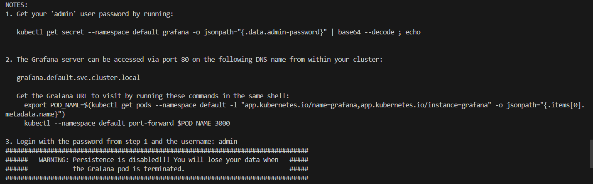
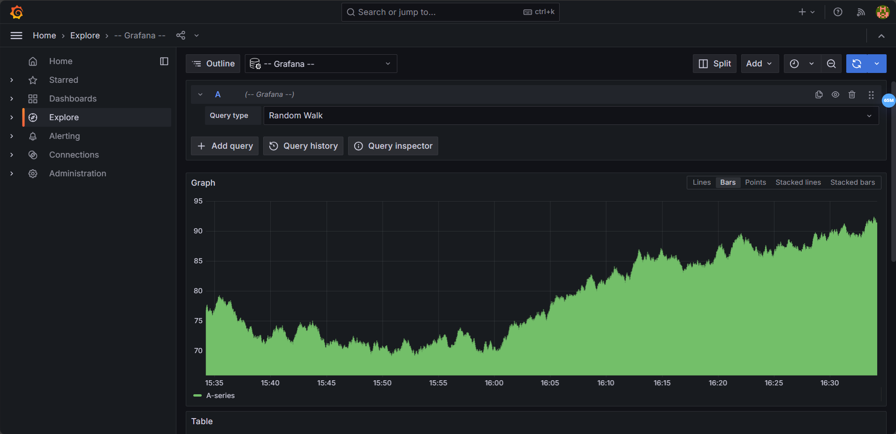

https://chatgpt.com/share/7a684605-7786-41e1-8709-b1b5f18bd535

## Check Kubectl Context First

```bash
kubectl config current-context
```

### Prometheus Operator Installation

```bash
helm repo add prometheus-community https://prometheus-community.github.io/helm-charts
helm repo update
helm install prometheus-operator prometheus-community/kube-prometheus-stack
kubectl --namespace default get pods -l "release=prometheus-operator"
```

#### Prometheus

```bash
kubectl port-forward svc/prometheus-operator-kube-p-prometheus 9090:9090 -n default
```

?

#### Alertmanager

```bash
kubectl port-forward svc/prometheus-operator-kube-p-alertmanager 9093:9093 -n default
```

?

#### Grafana



Access Grafana with the following command:

```bash
kubectl get secret --namespace default grafana -o jsonpath="{.data.admin-password}"
# go https://www.base64decode.org/ to decode the password
kubectl port-forward svc/prometheus-operator-grafana 3000:80 -n default 
# go http://localhost:3000/ to access Grafana
```


