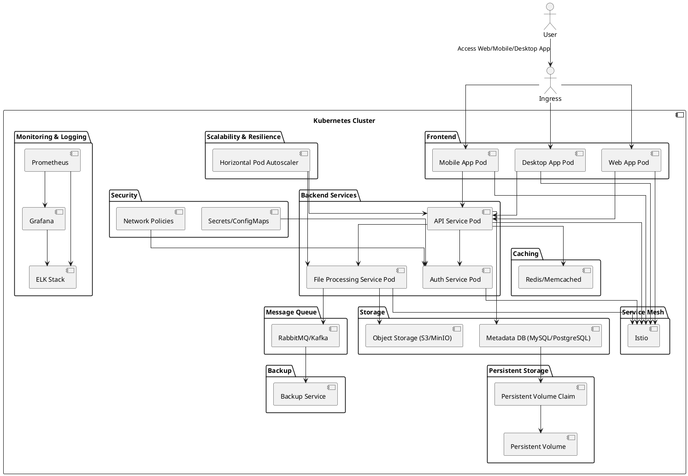

# KloudVault, a cloud-native storage solution built on Kubernetes.

## Architecture



## Directory Structure

```plaintext
KloudVault/
├── frontend/
│   ├── web_app/
│   │   ├── Dockerfile
│   │   ├── deployment.yaml
│   │   ├── service.yaml
│   │   ├── src/
│   │   │   ├── index.html
│   │   │   ├── main.js
│   │   │   └── styles.css
│   ├── mobile_app/
│   │   ├── Dockerfile
│   │   ├── deployment.yaml
│   │   ├── service.yaml
│   │   ├── src/
│   │   │   ├── App.js
│   │   │   └── styles.css
│   ├── desktop_app/
│   │   ├── Dockerfile
│   │   ├── deployment.yaml
│   │   ├── service.yaml
│   │   ├── src/
│   │   │   ├── main.js
│   │   │   └── styles.css
├── backend/
│   ├── api_service/
│   │   ├── Dockerfile
│   │   ├── deployment.yaml
│   │   ├── service.yaml
│   │   ├── src/
│   │   │   ├── app.py
│   │   │   └── requirements.txt
│   ├── auth_service/
│   │   ├── Dockerfile
│   │   ├── deployment.yaml
│   │   ├── service.yaml
│   │   ├── src/
│   │   │   ├── auth.py
│   │   │   └── requirements.txt
│   ├── file_processing_service/
│   │   ├── Dockerfile
│   │   ├── deployment.yaml
│   │   ├── service.yaml
│   │   ├── src/
│   │   │   ├── process.py
│   │   │   └── requirements.txt
├── storage/
│   ├── persistent_volume.yaml
│   ├── persistent_volume_claim.yaml
│   ├── object_storage/
│   │   ├── deployment.yaml
│   │   ├── service.yaml
│   │   ├── config/
│   │   │   ├── minio_config.json
│   ├── metadata_db/
│   │   ├── deployment.yaml
│   │   ├── service.yaml
│   │   ├── config/
│   │   │   ├── mysql_config.cnf
├── security/
│   ├── secrets/
│   │   ├── secrets.yaml
│   ├── configmaps/
│   │   ├── configmaps.yaml
│   ├── network_policies.yaml
├── monitoring_logging/
│   ├── prometheus/
│   │   ├── deployment.yaml
│   │   ├── service.yaml
│   │   ├── config/
│   │   │   ├── prometheus.yml
│   ├── grafana/
│   │   ├── deployment.yaml
│   │   ├── service.yaml
│   │   ├── config/
│   │   │   ├── grafana.ini
│   ├── elk/
│   │   ├── deployment.yaml
│   │   ├── service.yaml
│   │   ├── config/
│   │   │   ├── logstash.conf
├── scalability_resilience/
│   ├── hpa/
│   │   ├── api_service_hpa.yaml
│   │   ├── file_processing_service_hpa.yaml
├── caching/
│   ├── redis/
│   │   ├── deployment.yaml
│   │   ├── service.yaml
│   ├── memcached/
│   │   ├── deployment.yaml
│   │   ├── service.yaml
├── message_queue/
│   ├── rabbitmq/
│   │   ├── deployment.yaml
│   │   ├── service.yaml
│   ├── kafka/
│   │   ├── deployment.yaml
│   │   ├── service.yaml
├── backup/
│   ├── backup_service/
│   │   ├── deployment.yaml
│   │   ├── service.yaml
├── service_mesh/
│   ├── istio/
│   │   ├── istio-config.yaml
├── ingress/
│   ├── ingress.yaml
└── README.md
```
