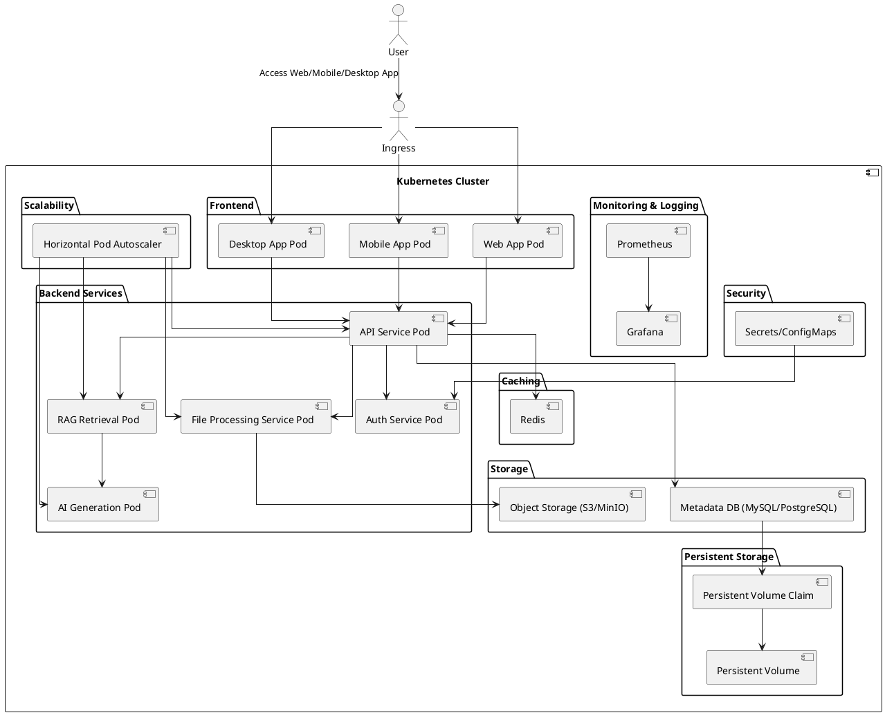

# KloudVault, a cloud-native storage solution built on Kubernetes.

## Architecture



## Directory Structure
```plaintext
KloudVault/
├── frontend/
│   ├── web_app/
│   │   ├── Dockerfile
│   │   ├── deployment.yaml
│   │   ├── service.yaml
│   │   ├── src/
│   │   │   ├── index.html
│   │   │   ├── main.js
│   │   │   └── styles.css
│   ├── mobile_app/
│   │   ├── Dockerfile
│   │   ├── deployment.yaml
│   │   ├── service.yaml
│   │   ├── src/
│   │   │   ├── App.js
│   │   │   └── styles.css
│   ├── desktop_app/
│   │   ├── Dockerfile
│   │   ├── deployment.yaml
│   │   ├── service.yaml
│   │   ├── src/
│   │   │   ├── main.js
│   │   │   └── styles.css
├── backend/
│   ├── api_service/
│   │   ├── Dockerfile
│   │   ├── deployment.yaml
│   │   ├── service.yaml
│   │   ├── src/
│   │   │   ├── app.py
│   │   │   └── requirements.txt
│   ├── auth_service/
│   │   ├── Dockerfile
│   │   ├── deployment.yaml
│   │   ├── service.yaml
│   │   ├── src/
│   │   │   ├── auth.py
│   │   │   └── requirements.txt
│   ├── file_processing_service/
│   │   ├── Dockerfile
│   │   ├── deployment.yaml
│   │   ├── service.yaml
│   │   ├── src/
│   │   │   ├── process.py
│   │   │   └── requirements.txt
│   ├── rag_retrieval_service/
│   │   ├── Dockerfile
│   │   ├── deployment.yaml
│   │   ├── service.yaml
│   │   ├── src/
│   │   │   ├── retrieve.py
│   │   │   └── requirements.txt
│   ├── ai_generation_service/
│   │   ├── Dockerfile
│   │   ├── deployment.yaml
│   │   ├── service.yaml
│   │   ├── src/
│   │   │   ├── generate.py
│   │   │   └── requirements.txt
├── storage/
│   ├── persistent_volume.yaml
│   ├── persistent_volume_claim.yaml
│   ├── object_storage/
│   │   ├── deployment.yaml
│   │   ├── service.yaml
│   │   ├── config/
│   │   │   ├── minio_config.json
│   ├── metadata_db/
│   │   ├── deployment.yaml
│   │   ├── service.yaml
│   │   ├── config/
│   │   │   ├── mysql_config.cnf
├── security/
│   ├── secrets/
│   │   ├── secrets.yaml
│   ├── configmaps/
│   │   ├── configmaps.yaml
├── monitoring_logging/
│   ├── prometheus/
│   │   ├── deployment.yaml
│   │   ├── service.yaml
│   │   ├── config/
│   │   │   ├── prometheus.yml
│   ├── grafana/
│   │   ├── deployment.yaml
│   │   ├── service.yaml
│   │   ├── config/
│   │   │   ├── grafana.ini
├── scalability/
│   ├── hpa/
│   │   ├── api_service_hpa.yaml
│   │   ├── file_processing_service_hpa.yaml
│   │   ├── rag_retrieval_service_hpa.yaml
│   │   ├── ai_generation_service_hpa.yaml
├── caching/
│   ├── redis/
│   │   ├── deployment.yaml
│   │   ├── service.yaml
├── ingress/
│   ├── ingress.yaml
└── README.md
```

# Features

## Core Features

- **Multi-Platform Access**: Access your files seamlessly across web, mobile, and desktop applications.
- **Secure Storage**: Utilize robust security measures with Kubernetes secrets and config maps to ensure your data is safe.
- **Scalable Architecture**: Automatically scale your storage needs with Kubernetes' horizontal pod autoscaler.
- **Persistent Storage**: Reliable and persistent storage using Kubernetes Persistent Volumes (PVs) and Persistent Volume Claims (PVCs).
- **High Availability**: Ensure data availability and reliability with managed object storage (S3/MinIO) and metadata databases (MySQL/PostgreSQL).

## Innovative Features

- **AI-Powered Document Management**:
  - **RAG Q&A Retrieval**: Integrate with large language model APIs to enable intelligent retrieval-augmented generation (RAG) for advanced question-answering capabilities.
  - **Document Summarization**: Automatically generate summaries of stored documents using state-of-the-art language models, saving time and improving productivity.
  - **Version Control**: Implement Git-like version management for documents, allowing users to track changes, revert to previous versions, and collaborate efficiently.

## Advanced Capabilities

- **Real-Time Caching**: Improve performance with Redis-based caching for frequently accessed data.
- **Monitoring and Logging**: Comprehensive monitoring and logging with Prometheus and Grafana for real-time insights and detailed analysis.
- **Authentication and Authorization**: Secure access to your storage with dedicated authentication services and role-based access control.

## User Experience

- **Intuitive Interface**: User-friendly interfaces for web, mobile, and desktop platforms ensure a seamless and consistent user experience.
- **Document Collaboration**: Enhance collaboration with features like shared access, version history, and real-time editing (planned for future releases).
- **Customizable Settings**: Personalize your storage experience with flexible configuration options.

## Security and Compliance

- **Data Encryption**: Ensure data security with encryption at rest and in transit.
- **Compliance**: Adhere to industry standards and regulations for data storage and management.

## Backup and Recovery

- **Data Backup**: Automated backup services to protect your data and ensure quick recovery in case of data loss (planned for future releases).
