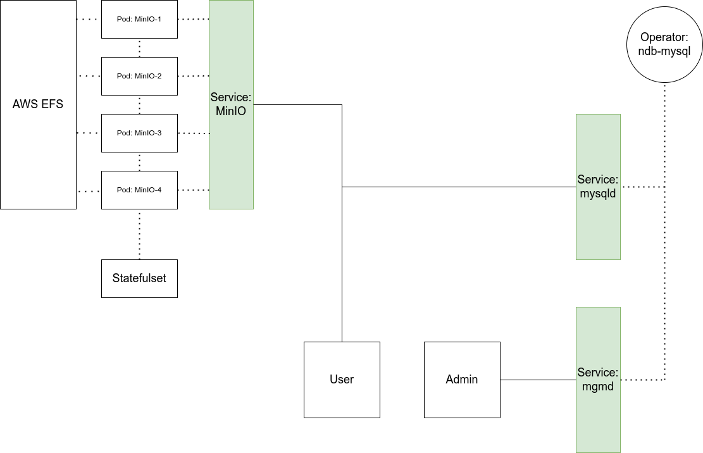
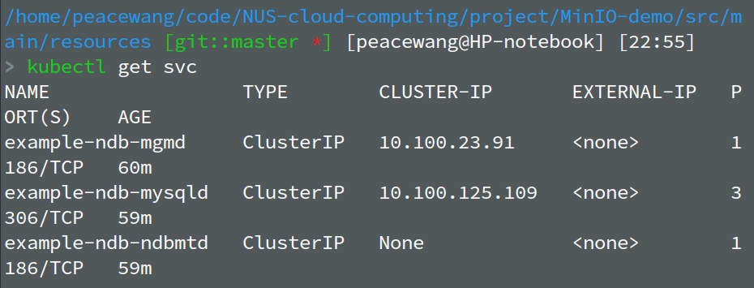
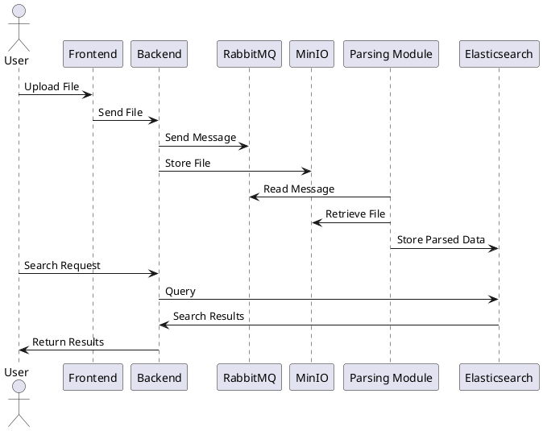

# KloudMinds
AI 驱动的云原生文件管理服务

文件存储 - 快速检索 - AI 阅读分析 一体化服务

# 1 version1-demo
v1 进行了一些基础功能的测试，主要是调试 MinIO、MySQL 模块和 kubernetes Service 的正常运行，非常简陋。

## 1.1 MinIO Service

使用挂载在 node 上的 Amazon EFS 作为 storageclass;

通过 statefulset 管理 4 个 MinIO Pod，每一个 Pod 申请 EFS-storageclass 并绑定 PV-Claim 作为存储;

通过 nodeport / forwarding 暴露出集群外的访问端口。

## 1.2 MySQL Service
使用 ndb-mysql operator 创建 mysql 服务，参考 [ndb-operator github](https://github.com/mysql/mysql-ndb-operator):

helm + operator 提供了一种便利且具有拓展性的云服务部署方式。

## 1.3 问题
MySQL Service 中如果使用 loadbalancer 暴露出端口，会无法访问。

# 2 version2
增加的功能：

- elastic search

- RAG

- openAI API

## 2.1 elastic-search

使用 elastic-search 数据库提供精确搜索，搜索包含指定内容的文件名。

## 2.2 RAG

向量化的模糊搜索。

## 2.3 AI chat

输入文件名和 prompt，返回大模型生成的结果。